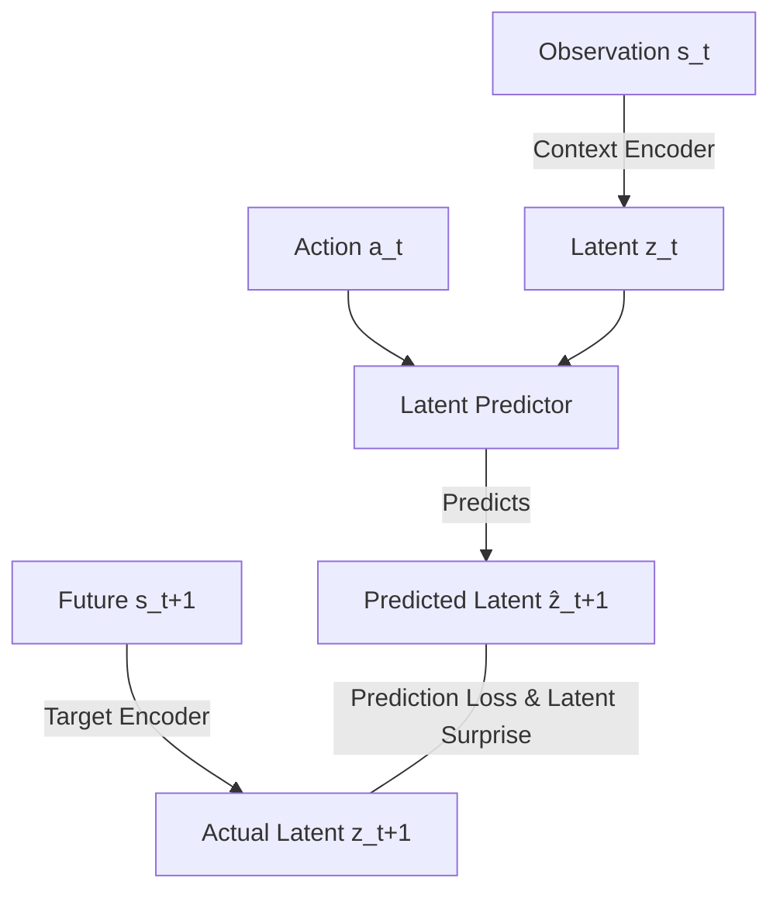

# Hướng Dẫn Nghiên Cứu & Lộ Trình Triển Khai (Research Roadmap)

## Đề tài: Can Lightweight JEPA-based World Models Detect Out-of-Distribution Dynamics in Atari and Procgen Games?

Chào bạn! Dưới đây là bản định hướng nghiên cứu và lộ trình chi tiết (Research Roadmap) được xây dựng dựa trên yêu cầu cốt lõi (req.md) của bạn. Tài liệu này sẽ giúp bạn hiểu sâu về lý thuyết, nắm bắt cấu trúc hệ thống và có các bước đi cụ thể để hiện thực hóa đề tài nghiên cứu đầy tiềm năng này.

---

## 1. Cơ Sở Lý Thuyết & Tại Sao Chọn LeWM (JEPA)?

### 1.1. Vấn đề của World Model truyền thống (Reconstruction-based)
Các World Model truyền thống (như **DreamerV3, RSSM, MuZero**) thường cố gắng tái tạo lại toàn bộ hình ảnh ở pixel-level (Pixel Reconstruction) hoặc lượng tử hóa thành các token rời rạc. Điều này dẫn đến hai nhược điểm chí tử:
1. **Lãng phí tài nguyên**: Mô hình dành quá nhiều dung lượng mạng để học những chi tiết không liên quan đến hành động hay vật lý của game (ví dụ: màu nền đổi, đám mây bay qua, hiệu ứng lấp lánh).
2. **Nhạy cảm quá mức với Visual OOD**: Khi màu sắc hoặc texture thay đổi (Visual OOD), mô hình reconstruction sẽ báo động "Surprise" rất cao mặc dù quy luật vật lý (Dynamics) của game hoàn toàn không đổi.

### 1.2. Giải pháp từ JEPA (Joint Embedding Predictive Architecture)
Yann LeCun đề xuất **JEPA** để giải quyết vấn đề này. Thay vì dự đoán pixel, JEPA mã hóa cả trạng thái hiện tại và trạng thái tương lai vào không gian ẩn (**Latent Space**) và thực hiện việc dự đoán hoàn toàn trong không gian ẩn đó.



* **LeWM (LeWorldModel)** (arXiv:2603.19312) là một bước đột phá vì nó loại bỏ các heuristic phức tạp (như stop-gradient, EMA target encoder) nhờ vào **SIGReg** (Sketched Isotropic Gaussian Regularization) giúp phân phối latent tuân theo phân phối Gaussian chuẩn, ngăn chặn hiện tượng **Representation Collapse** (sụp đổ biểu diễn) một cách cực kỳ hiệu quả và huấn luyện end-to-end cực kỳ ổn định.

### 1.3. Cơ chế Phát hiện OOD Dynamics qua "Latent Surprise"
Do LeWM được huấn luyện để tối ưu hóa việc dự đoán chuyển dịch trạng thái ẩn:
$$\hat{z}_{t+1} = \text{Predictor}(z_t, a_t)$$
Khi môi trường hoạt động bình thường (In-Distribution - ID), khoảng cách giữa latent dự đoán $\hat{z}_{t+1}$ và latent thực tế $z_{t+1}$ sẽ rất nhỏ:
$$\text{Latent Surprise } S_t = \|\hat{z}_{t+1} - z_{t+1}\|_2^2 \approx 0$$
Khi có sự thay đổi đột ngột về vật lý (OOD Dynamics - ví dụ: thay đổi trọng lực, tốc độ game, luật va chạm), **Predictor** (vốn chỉ được học luật cũ) sẽ dự đoán sai lệch lớn, dẫn đến việc **Latent Surprise vọt lên cao**, ngay cả khi hình ảnh trực quan của frame đơn lẻ trông không có gì khác biệt!

---

## 2. Kiến Trúc Hệ Thống Đề Xuất (Proposed Architecture)

Hệ thống nghiên cứu của bạn sẽ bao gồm 4 khối chính:

```
[ Game Environment (Atari/Procgen) ]
         | (Frame s_t, Action a_t)
         v
+-------------------------------------------------------+
| 1. LeWM World Model (JEPA)                            |
|    - Context Encoder: s_t -> z_t                      |
|    - Target Encoder: s_t+1 -> z_t+1                  |
|    - Latent Predictor: (z_t, a_t) -> ẑ_t+1            |
|    - SIGReg Regularizer (Tránh collapse)              |
+-------------------------------------------------------+
         | (ẑ_t+1, z_t+1)
         v
+-------------------------------------------------------+
| 2. Latent Surprise Calculator                        |
|    - Tính toán khoảng cách ẩn: d(ẑ_t+1, z_t+1)         |
|    - Sử dụng Exponential Moving Average (EMA) để      |
|      chuẩn hóa ngưỡng phát hiện động.                  |
+-------------------------------------------------------+
         | Surprise Score
         v
+-------------------------------------------------------+
| 3. OOD Dynamics Detector                              |
|    - Phân loại ID vs OOD dựa trên ngưỡng động.         |
|    - Đánh giá thời gian phát hiện (detection delay).  |
+-------------------------------------------------------+
         | Evaluation Metrics
         v
+-------------------------------------------------------+
| 4. Evaluation Suite                                   |
|    - Tính toán AUROC, F1-Score cho OOD detection.     |
|    - Đo lường Return Degradation & Planning Success.  |
+-------------------------------------------------------+
```

---

## 3. Lộ Trình Nghiên Cứu Từng Bước (Research Roadmap)

Để thực hiện đề tài này một cách khoa học và hiệu quả, bạn nên chia làm **5 giai đoạn** chính:

### Giai Đoạn 1: Thiết Lập Môi Trường & Công Cụ Nghiên Cứu (Tuần 1 - 2)
> [!IMPORTANT]
> Mục tiêu: Thiết lập được môi trường chạy code ổn định và nắm rõ cách thức tương tác với các benchmark Atari và Procgen.

- [ ] **Cài đặt thư viện**: Thiết lập Python environment với PyTorch, `gymnasium`, `stable-baselines3` (để lấy RL agents) và các package Atari (`shimmy[atari]`, `ale-py`) cùng Procgen.
- [ ] **Tạo OOD Dynamics Simulator**: Viết các custom `Gymnasium.Wrapper` để can thiệp vào game dynamics:
  - *Atari*: Thay đổi `frameskip` (ví dụ từ 4 sang 2 hoặc 8 để đổi tốc độ động học), thay đổi xác suất trượt chân (sticky actions).
  - *Procgen*: Can thiệp vào file cấu hình (Procgen cho phép đổi gravity, friction, speed của các thực thể qua context parameters).
- [ ] **Thu thập Dataset (Rollout Buffer)**: Huấn luyện một RL agent cơ bản (PPO hoặc DQN) trên môi trường chuẩn (In-Distribution) và lưu lại các quỹ đạo (trajectory) gồm `(obs, action, next_obs, reward, terminated)`.

### Giai Đoạn 2: Hiện Thực Hóa LeWorldModel (LeWM) (Tuần 3 - 4)
> [!TIP]
> Mục tiêu: Tích hợp thành công mô hình LeWM nguyên bản và huấn luyện nó trên dữ liệu ID.

- [ ] **Nghiên cứu Codebase gốc**: Tham khảo repository chính thức của tác giả: [lucas-maes/le-wm](https://github.com/lucas-maes/le-wm).
- [ ] **Xây dựng Encoder & Predictor**:
  - **Encoder (Context & Target)**: Mạng CNN nhẹ (ví dụ: 3-4 lớp convolutional) nén frame hình ảnh $84 \times 84$ thành vector ẩn $z \in \mathbb{R}^d$. Trong LeWM, Context và Target Encoder thường chia sẻ trọng số (Siamese architecture) và không cần EMA.
  - **Predictor**: Một mạng MLP hoặc ResNet block nhận đầu vào là $[z_t, e(a_t)]$ (với $e(a_t)$ là action embedding cho các hành động rời rạc của Atari/Procgen) và dự đoán $\hat{z}_{t+1}$.
- [ ] **Cài đặt SIGReg Loss**: Viết hàm loss SIGReg để ép phân phối ẩn tuân theo chuẩn hóa isotropic Gaussian, đảm bảo encoder không bị collapse.
- [ ] **Huấn Luyện Mô Hình**: Train LeWM trên tập dữ liệu ID đã thu thập ở Giai đoạn 1. Đảm bảo loss hội tụ ổn định.

### Giai Đoạn 3: Thiết Kế Bộ Phát Hiện OOD Dynamics & Latent Surprise (Tuần 5 - 6)
> [!NOTE]
> Giai đoạn này cực kỳ quan trọng, là trọng tâm đóng góp khoa học của đề tài.

- [ ] **Tính toán Latent Surprise**: 
  - Thực nghiệm các metric đo khoảng cách không gian ẩn: L2 distance, Cosine similarity, hoặc Mahalanobis distance.
- [ ] **Thiết kế Cơ Chế Chuẩn Hóa (Normalization)**:
  - Do mỗi trạng thái game có mức độ phức tạp khác nhau, ta cần chuẩn hóa Latent Surprise theo thời gian sử dụng một bộ lọc EMA:
    $$\mu_t = \alpha \mu_{t-1} + (1-\alpha) S_t$$
    $$\sigma_t^2 = \alpha \sigma_{t-1}^2 + (1-\alpha) (S_t - \mu_t)^2$$
    $$\text{Normalized Surprise } \tilde{S}_t = \frac{S_t - \mu_t}{\sigma_t}$$
- [ ] **Baseline đối chứng**: Xây dựng một **Reconstruction-based World Model** đơn giản (ví dụ: AE/VAE + Predictor dự đoán pixel tương lai) để so sánh. Đo lượng "Pixel Reconstruction Surprise" để chứng minh tính ưu việt của Latent Surprise từ JEPA.

### Giai Đoạn 4: Đánh Giá Thực Nghiệm & Đo Lường Metrics (Tuần 7 - 8)
> [!IMPORTANT]
> Thu thập số liệu để chứng minh giả thuyết nghiên cứu: *"LeWM phát hiện OOD nhanh và chính xác hơn baseline pixel-based, đặc biệt là khi OOD chưa xuất hiện rõ ở visual frame lẻ."*

- [ ] **OOD Detection Metrics**:
  - Chạy thử nghiệm trên các quỹ đạo chứa cả phân đoạn ID và phân đoạn đột ngột chuyển sang OOD.
  - Tính toán **AUROC** (Area Under the ROC Curve) và **F1-Score** cho bài toán phân loại nhị phân (ID vs OOD).
- [ ] **Return Degradation vs Surprise Correlation**: Đánh giá mối tương quan giữa mức độ sụt giảm điểm số của RL agent và độ lớn của Latent Surprise.
- [ ] **Planning Success**:
  - Sử dụng LeWM để chạy **Model Predictive Control (MPC)** trong không gian ẩn.
  - So sánh tỷ lệ lập kế hoạch thành công (Planning Success) khi gặp OOD dynamics.
- [ ] **Calibration Error**: Đo độ tin cậy của bộ phát hiện (surprise score có phản ánh đúng xác suất thực sự xảy ra OOD không).

### Giai Đoạn 5: Phân Tích Kết Quả & Viết Báo Cáo / Paper (Tuần 9 - 10)
- [ ] **Vẽ Biểu Đồ & Trực Quan Hóa**: Vẽ biểu đồ biểu diễn Latent Surprise vọt lên tại thời điểm chính xác xảy ra OOD (như đổi gravity). Trực quan hóa không gian ẩn bằng t-SNE để chứng minh OOD dynamics tạo ra một cụm tách biệt rõ ràng.
- [ ] **Viết báo cáo / Viết Paper**: Hệ thống hóa các kết quả thực nghiệm, cấu trúc bài báo theo định dạng chuẩn khoa học (Abstract, Introduction, Related Work, Methodology, Experiments, Conclusion).

---

## 4. Các Thử Thách Lớn Dự Kiến & Phương Án Giải Quyết (Potential Challenges)

### Thách thức 1: Phân biệt giữa "OOD Visual" và "OOD Dynamics"
* *Vấn đề*: Nếu môi trường đổi màu nền (Visual OOD) nhưng vật lý vẫn giữ nguyên, làm sao để hệ thống không báo động nhầm?
* *Giải pháp*: JEPA về bản chất loại bỏ thông tin visual không liên quan đến dự đoán hành động. Bằng cách huấn luyện LeWM với SIGReg, mô hình sẽ phớt lờ các thay đổi visual vô hại. Bạn có thể thiết kế một thí nghiệm đối chứng: thay đổi màu sắc background (Visual OOD) và kiểm tra xem Latent Surprise của LeWM có giữ nguyên ở mức thấp không, so sánh trực tiếp với bộ VAE (sẽ bị báo động đỏ).

### Thách thức 2: Cách can thiệp sâu vào vật lý của Procgen/Atari
* *Vấn đề*: Atari chạy trên giả lập Stella rất khó thay đổi trọng lực trực tiếp bằng code Python thông thường.
* *Giải pháp*: 
  - Đối với Atari: Thay đổi `frameskip` (ví dụ: huấn luyện trên frameskip=4, test trên frameskip=3 hoặc 5). Việc này trực tiếp thay đổi gia tốc và vận tốc chuyển động của các vật thể dưới góc nhìn của Agent. Hoặc thay đổi hành vi quái thông qua can thiệp RAM state.
  - Đối với Procgen: Procgen sử dụng game engine viết bằng C++. Bạn có thể điều khiển tham số môi trường thông qua `distribution_mode` hoặc truyền các tham số tùy chỉnh thông qua OpenAI Gym wrappers nếu dùng bản Procgen hỗ trợ tùy biến context.

---

## Các Bước Cụ Thể Bạn Nên Làm Ngay Hôm Nay Để Nghiên Cứu:

1. **Đọc kỹ bài báo gốc LeWorldModel**: Hãy download và đọc bài viết [arXiv:2603.19312](https://arxiv.org/abs/2603.19312).
2. **Khám phá Github của LeWM**: Hãy vào xem repo [lucas-maes/le-wm](https://github.com/lucas-maes/le-wm) để xem cách họ thiết kế encoder, predictor và đặc biệt là cách họ viết loss **SIGReg**.
3. **Lựa chọn Game**: Nên chọn 1 game Atari đơn giản trước (như **Breakout** hoặc **Pong**) và 1 game Procgen (như **CoinRun**) để bắt đầu làm quen.

Chúc bạn có một hành trình nghiên cứu thật thành công! Mình luôn ở đây để đồng hành và hỗ trợ bạn lập trình cũng như gỡ lỗi cho từng giai đoạn của đề tài này!
